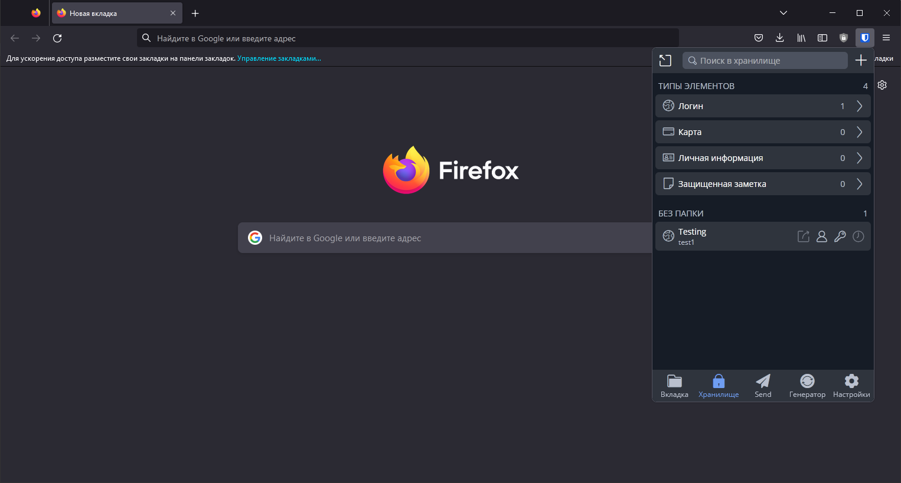
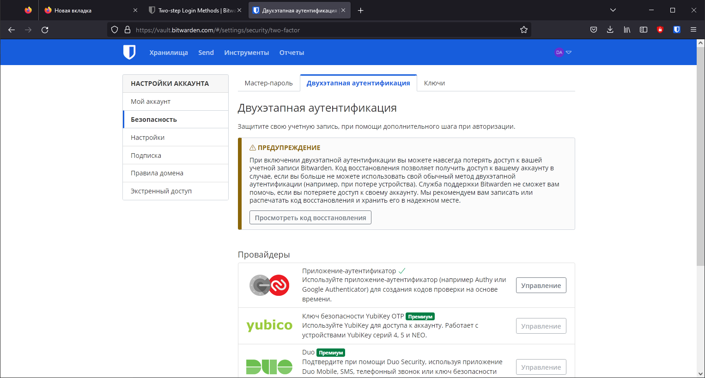
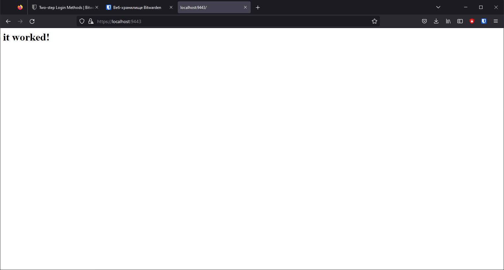
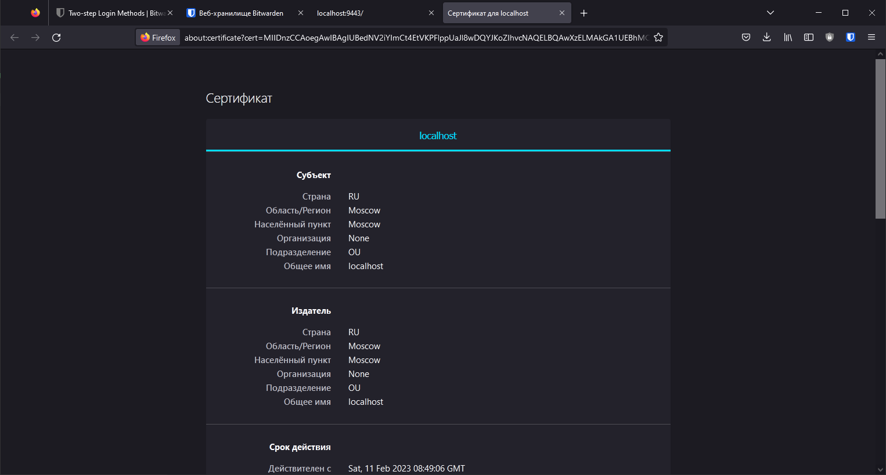
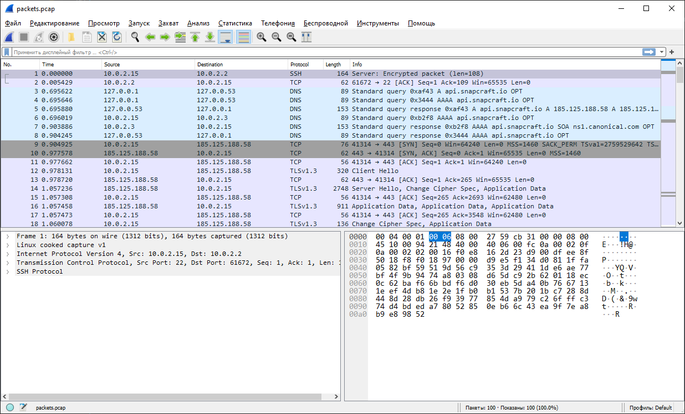

# Домашнее задание к занятию "3.2. Работа в терминале. Лекция 2"

## 1. Установите Bitwarden плагин для браузера. Зарегестрируйтесь и сохраните несколько паролей.

Установил, зарегистрировался, добавил тестовый логин

## 2. Установите Google authenticator на мобильный телефон. Настройте вход в Bitwarden акаунт через Google authenticator OTP.

Использую OTP от Яндекс, настроил otp на аккаунт

## 3. Установите apache2, сгенерируйте самоподписанный сертификат, настройте тестовый сайт для работы по HTTPS.

Произвел настройку по мануалу - <https://digitalocean.com/community/tutorials/how-to-create-a-self-signed-ssl-certificate-for-apache-in-ubuntu-20-04>, использовал локальную ВМ, пробросив порт 443 ВМ на 9443 хост машины

## 4. Проверьте на TLS уязвимости произвольный сайт в интернете (кроме сайтов МВД, ФСБ, МинОбр, НацБанк, РосКосмос, РосАтом, РосНАНО и любых госкомпаний, объектов КИИ, ВПК ... и тому подобное).

Нашел утилиту testssl.sh (<https://github.com/drwetter/testssl.sh>)

       vagrant@vagrant:~/testssl.sh$ ./testssl.sh google.com
       
       ###########################################################
           testssl.sh       3.2rc2 from https://testssl.sh/dev/
           (e57527f 2023-02-08 17:07:42)
       
             This program is free software. Distribution and
                    modification under GPLv2 permitted.
             USAGE w/o ANY WARRANTY. USE IT AT YOUR OWN RISK!
       
              Please file bugs @ https://testssl.sh/bugs/
       
       ###########################################################
       
        Using "OpenSSL 1.0.2-bad (1.0.2k-dev)" [~183 ciphers]
        on vagrant:./bin/openssl.Linux.x86_64
        (built: "Sep  1 14:03:44 2022", platform: "linux-x86_64")
       
       
       Testing all IPv4 addresses (port 443): 64.233.164.138 64.233.164.101 64.233.164.100 64.233.164.139 64.233.164.113 64.233.164.102
       --------------------------------------------------------------------------------
        Start 2023-02-11 09:24:05        -->> 64.233.164.138:443 (google.com) <<--
       
        Further IP addresses:   64.233.164.102 64.233.164.113 64.233.164.139 64.233.164.100 64.233.164.101
                                2a00:1450:4010:c07::66 2a00:1450:4010:c07::8b 2a00:1450:4010:c07::71 2a00:1450:4010:c07::8a
        rDNS (64.233.164.138):  lf-in-f138.1e100.net.
        Service detected:       HTTP
       
       
        Testing protocols via sockets except NPN+ALPN
       
        SSLv2      not offered (OK)
        SSLv3      not offered (OK)
        TLS 1      offered (deprecated)
        TLS 1.1    offered (deprecated)
        TLS 1.2    offered (OK)
        TLS 1.3    offered (OK): final
        NPN/SPDY   grpc-exp, h2, http/1.1 (advertised)
        ALPN/HTTP2 h2, http/1.1, grpc-exp (offered)
       
        Testing cipher categories
       
        NULL ciphers (no encryption)                      not offered (OK)
        Anonymous NULL Ciphers (no authentication)        not offered (OK)
        Export ciphers (w/o ADH+NULL)                     not offered (OK)
        LOW: 64 Bit + DES, RC[2,4], MD5 (w/o export)      not offered (OK)
        Triple DES Ciphers / IDEA                         offered
        Obsoleted CBC ciphers (AES, ARIA etc.)            offered
        Strong encryption (AEAD ciphers) with no FS       offered (OK)
        Forward Secrecy strong encryption (AEAD ciphers)  offered (OK)
       
       
        Testing server's cipher preferences
       
       Hexcode  Cipher Suite Name (OpenSSL)       KeyExch.   Encryption  Bits     Cipher Suite Name (IANA/RFC)
       -----------------------------------------------------------------------------------------------------------------------------
       SSLv2
        -
       SSLv3
        -
       TLSv1 (server order)
        xc009   ECDHE-ECDSA-AES128-SHA            ECDH 256   AES         128      TLS_ECDHE_ECDSA_WITH_AES_128_CBC_SHA
       
        xc00a   ECDHE-ECDSA-AES256-SHA            ECDH 256   AES         256      TLS_ECDHE_ECDSA_WITH_AES_256_CBC_SHA
       
        xc013   ECDHE-RSA-AES128-SHA              ECDH 256   AES         128      TLS_ECDHE_RSA_WITH_AES_128_CBC_SHA
       
        xc014   ECDHE-RSA-AES256-SHA              ECDH 256   AES         256      TLS_ECDHE_RSA_WITH_AES_256_CBC_SHA
       
        x2f     AES128-SHA                        RSA        AES         128      TLS_RSA_WITH_AES_128_CBC_SHA
       
        x35     AES256-SHA                        RSA        AES         256      TLS_RSA_WITH_AES_256_CBC_SHA
       
        x0a     DES-CBC3-SHA                      RSA        3DES        168      TLS_RSA_WITH_3DES_EDE_CBC_SHA
       
       TLSv1.1 (server order)
        xc009   ECDHE-ECDSA-AES128-SHA            ECDH 256   AES         128      TLS_ECDHE_ECDSA_WITH_AES_128_CBC_SHA
       
        xc00a   ECDHE-ECDSA-AES256-SHA            ECDH 256   AES         256      TLS_ECDHE_ECDSA_WITH_AES_256_CBC_SHA
       
        xc013   ECDHE-RSA-AES128-SHA              ECDH 256   AES         128      TLS_ECDHE_RSA_WITH_AES_128_CBC_SHA
       
        xc014   ECDHE-RSA-AES256-SHA              ECDH 256   AES         256      TLS_ECDHE_RSA_WITH_AES_256_CBC_SHA
       
        x2f     AES128-SHA                        RSA        AES         128      TLS_RSA_WITH_AES_128_CBC_SHA
       
        x35     AES256-SHA                        RSA        AES         256      TLS_RSA_WITH_AES_256_CBC_SHA
       
        x0a     DES-CBC3-SHA                      RSA        3DES        168      TLS_RSA_WITH_3DES_EDE_CBC_SHA
       
       TLSv1.2 (server order -- server prioritizes ChaCha ciphers when preferred by clients)
        xc02b   ECDHE-ECDSA-AES128-GCM-SHA256     ECDH 253   AESGCM      128      TLS_ECDHE_ECDSA_WITH_AES_128_GCM_SHA256
       
        xcca9   ECDHE-ECDSA-CHACHA20-POLY1305     ECDH 253   ChaCha20    256      TLS_ECDHE_ECDSA_WITH_CHACHA20_POLY1305_SHA256
       
        xc02c   ECDHE-ECDSA-AES256-GCM-SHA384     ECDH 253   AESGCM      256      TLS_ECDHE_ECDSA_WITH_AES_256_GCM_SHA384
       
        xc009   ECDHE-ECDSA-AES128-SHA            ECDH 253   AES         128      TLS_ECDHE_ECDSA_WITH_AES_128_CBC_SHA
       
        xc00a   ECDHE-ECDSA-AES256-SHA            ECDH 253   AES         256      TLS_ECDHE_ECDSA_WITH_AES_256_CBC_SHA
       
        xc02f   ECDHE-RSA-AES128-GCM-SHA256       ECDH 253   AESGCM      128      TLS_ECDHE_RSA_WITH_AES_128_GCM_SHA256
       
        xcca8   ECDHE-RSA-CHACHA20-POLY1305       ECDH 253   ChaCha20    256      TLS_ECDHE_RSA_WITH_CHACHA20_POLY1305_SHA256
       
        xc030   ECDHE-RSA-AES256-GCM-SHA384       ECDH 253   AESGCM      256      TLS_ECDHE_RSA_WITH_AES_256_GCM_SHA384
       
        xc013   ECDHE-RSA-AES128-SHA              ECDH 253   AES         128      TLS_ECDHE_RSA_WITH_AES_128_CBC_SHA
       
        xc014   ECDHE-RSA-AES256-SHA              ECDH 253   AES         256      TLS_ECDHE_RSA_WITH_AES_256_CBC_SHA
       
        x9c     AES128-GCM-SHA256                 RSA        AESGCM      128      TLS_RSA_WITH_AES_128_GCM_SHA256
       
        x9d     AES256-GCM-SHA384                 RSA        AESGCM      256      TLS_RSA_WITH_AES_256_GCM_SHA384
       
        x2f     AES128-SHA                        RSA        AES         128      TLS_RSA_WITH_AES_128_CBC_SHA
       
        x35     AES256-SHA                        RSA        AES         256      TLS_RSA_WITH_AES_256_CBC_SHA
       
        x0a     DES-CBC3-SHA                      RSA        3DES        168      TLS_RSA_WITH_3DES_EDE_CBC_SHA
       
       TLSv1.3 (no server order, thus listed by strength)
        x1302   TLS_AES_256_GCM_SHA384            ECDH 253   AESGCM      256      TLS_AES_256_GCM_SHA384
       
        x1303   TLS_CHACHA20_POLY1305_SHA256      ECDH 253   ChaCha20    256      TLS_CHACHA20_POLY1305_SHA256
       
        x1301   TLS_AES_128_GCM_SHA256            ECDH 253   AESGCM      128      TLS_AES_128_GCM_SHA256
       
       
        Has server cipher order?     yes (OK) -- only for < TLS 1.3
       
       
        Testing robust forward secrecy (FS) -- omitting Null Authentication/Encryption, 3DES, RC4
       
        FS is offered (OK)           TLS_AES_256_GCM_SHA384 TLS_CHACHA20_POLY1305_SHA256 ECDHE-RSA-AES256-GCM-SHA384
                                     ECDHE-ECDSA-AES256-GCM-SHA384 ECDHE-RSA-AES256-SHA ECDHE-ECDSA-AES256-SHA
                                     ECDHE-ECDSA-CHACHA20-POLY1305 ECDHE-RSA-CHACHA20-POLY1305 TLS_AES_128_GCM_SHA256
                                     ECDHE-RSA-AES128-GCM-SHA256 ECDHE-ECDSA-AES128-GCM-SHA256 ECDHE-RSA-AES128-SHA
                                     ECDHE-ECDSA-AES128-SHA
        Elliptic curves offered:     prime256v1 X25519
        TLS 1.2 sig_algs offered:    RSA-PSS+SHA256 RSA+SHA256 RSA-PSS+SHA384 RSA+SHA384 RSA-PSS+SHA512 RSA+SHA512 RSA+SHA1
                                     ECDSA+SHA256 ECDSA+SHA384 ECDSA+SHA512 ECDSA+SHA1
        TLS 1.3 sig_algs offered:    ECDSA+SHA256 RSA-PSS+SHA256 RSA-PSS+SHA384 RSA-PSS+SHA512
       
        Testing server defaults (Server Hello)
       
        TLS extensions (standard)    "renegotiation info/#65281" "EC point formats/#11" "session ticket/#35"
                                     "next protocol/#13172" "key share/#51" "supported versions/#43"
                                     "extended master secret/#23" "application layer protocol negotiation/#16"
        Session Ticket RFC 5077 hint 100800 seconds but: FS requires session ticket keys to be rotated < daily !
        SSL Session ID support       yes
        Session Resumption           Tickets: yes, ID: yes
        TLS clock skew               0 sec from localtime
        Certificate Compression      none
        Client Authentication        none
       
         Server Certificate #1
          Signature Algorithm          SHA256 with RSA
          Server key size              RSA 2048 bits (exponent is 65537)
          Server key usage             Digital Signature, Key Encipherment
          Server extended key usage    TLS Web Server Authentication
          Serial                       F29B38846476A3051282672489BB613E (OK: length 16)
          Fingerprints                 SHA1 BFD9D8A0C3AB035A95B160374BD8377B65AF347B
                                       SHA256 6C28D173E3123E188102A25AA87CBC005512FC894DF7E0076CA057ECC67DA967
          Common Name (CN)             *.google.com  (CN in response to request w/o SNI: invalid2.invalid )
          subjectAltName (SAN)         *.google.com *.appengine.google.com *.bdn.dev *.origin-test.bdn.dev *.cloud.google.com
                                       *.crowdsource.google.com *.datacompute.google.com *.google.ca *.google.cl
                                       *.google.co.in *.google.co.jp *.google.co.uk *.google.com.ar *.google.com.au
                                       *.google.com.br *.google.com.co *.google.com.mx *.google.com.tr *.google.com.vn
                                       *.google.de *.google.es *.google.fr *.google.hu *.google.it *.google.nl *.google.pl
                                       *.google.pt *.googleadapis.com *.googleapis.cn *.googlevideo.com *.gstatic.cn
                                       *.gstatic-cn.com googlecnapps.cn *.googlecnapps.cn googleapps-cn.com
                                       *.googleapps-cn.com gkecnapps.cn *.gkecnapps.cn googledownloads.cn *.googledownloads.cn
                                       recaptcha.net.cn *.recaptcha.net.cn recaptcha-cn.net *.recaptcha-cn.net widevine.cn
                                       *.widevine.cn ampproject.org.cn *.ampproject.org.cn ampproject.net.cn
                                       *.ampproject.net.cn google-analytics-cn.com *.google-analytics-cn.com
                                       googleadservices-cn.com *.googleadservices-cn.com googlevads-cn.com *.googlevads-cn.com
                                       googleapis-cn.com *.googleapis-cn.com googleoptimize-cn.com *.googleoptimize-cn.com
                                       doubleclick-cn.net *.doubleclick-cn.net *.fls.doubleclick-cn.net *.g.doubleclick-cn.net
                                       doubleclick.cn *.doubleclick.cn *.fls.doubleclick.cn *.g.doubleclick.cn
                                       dartsearch-cn.net *.dartsearch-cn.net googletraveladservices-cn.com
                                       *.googletraveladservices-cn.com googletagservices-cn.com *.googletagservices-cn.com
                                       googletagmanager-cn.com *.googletagmanager-cn.com googlesyndication-cn.com
                                       *.googlesyndication-cn.com *.safeframe.googlesyndication-cn.com app-measurement-cn.com
                                       *.app-measurement-cn.com gvt1-cn.com *.gvt1-cn.com gvt2-cn.com *.gvt2-cn.com
                                       2mdn-cn.net *.2mdn-cn.net googleflights-cn.net *.googleflights-cn.net admob-cn.com
                                       *.admob-cn.com googlesandbox-cn.com *.googlesandbox-cn.com
                                       *.safenup.googlesandbox-cn.com *.gstatic.com *.metric.gstatic.com *.gvt1.com
                                       *.gcpcdn.gvt1.com *.gvt2.com *.gcp.gvt2.com *.url.google.com *.youtube-nocookie.com
                                       *.ytimg.com android.com *.android.com *.flash.android.com g.cn *.g.cn g.co *.g.co
                                       goo.gl www.goo.gl google-analytics.com *.google-analytics.com google.com
                                       googlecommerce.com *.googlecommerce.com ggpht.cn *.ggpht.cn urchin.com *.urchin.com
                                       youtu.be youtube.com *.youtube.com youtubeeducation.com *.youtubeeducation.com
                                       youtubekids.com *.youtubekids.com yt.be *.yt.be android.clients.google.com
                                       developer.android.google.cn developers.android.google.cn source.android.google.cn
          Trust (hostname)             Ok via SAN (SNI mandatory)
          Chain of trust               Ok
          EV cert (experimental)       no
          Certificate Validity (UTC)   73 >= 60 days (2023-01-31 10:19 --> 2023-04-25 10:19)
          ETS/"eTLS", visibility info  not present
          Certificate Revocation List  http://crls.pki.goog/gts1c3/moVDfISia2k.crl
          OCSP URI                     http://ocsp.pki.goog/gts1c3
          OCSP stapling                not offered
          OCSP must staple extension   --
          DNS CAA RR (experimental)    available - please check for match with "Issuer" below: issue=pki.goog
          Certificate Transparency     yes (certificate extension)
          Certificates provided        3
          Issuer                       GTS CA 1C3 (Google Trust Services LLC from US)
          Intermediate cert validity   #1: ok > 40 days (2027-09-30 00:00). GTS CA 1C3 <-- GTS Root R1
                                         #2: ok > 40 days (2028-01-28 00:00). GTS Root R1 <-- GlobalSign Root CA
          Intermediate Bad OCSP (exp.) Ok
       
         Server Certificate #2
          Signature Algorithm          SHA256 with RSA
          Server key size              EC 256 bits (curve P-256)
          Server key usage             Digital Signature
          Server extended key usage    TLS Web Server Authentication
          Serial                       0EF410A0FDB4F8C10A6B009A6CE10BFB (OK: length 16)
          Fingerprints                 SHA1 702F78E7F62FA742A895BA1FFFF2734F2DDA782D
                                       SHA256 51E9015FFEFB7970D8DF74BB46946372B1E32B316A46F0C536E7C1D4DDC5B270
          Common Name (CN)             *.google.com  (CN in response to request w/o SNI: invalid2.invalid )
          subjectAltName (SAN)         *.google.com *.appengine.google.com *.bdn.dev *.origin-test.bdn.dev *.cloud.google.com
                                       *.crowdsource.google.com *.datacompute.google.com *.google.ca *.google.cl
                                       *.google.co.in *.google.co.jp *.google.co.uk *.google.com.ar *.google.com.au
                                       *.google.com.br *.google.com.co *.google.com.mx *.google.com.tr *.google.com.vn
                                       *.google.de *.google.es *.google.fr *.google.hu *.google.it *.google.nl *.google.pl
                                       *.google.pt *.googleadapis.com *.googleapis.cn *.googlevideo.com *.gstatic.cn
                                       *.gstatic-cn.com googlecnapps.cn *.googlecnapps.cn googleapps-cn.com
                                       *.googleapps-cn.com gkecnapps.cn *.gkecnapps.cn googledownloads.cn *.googledownloads.cn
                                       recaptcha.net.cn *.recaptcha.net.cn recaptcha-cn.net *.recaptcha-cn.net widevine.cn
                                       *.widevine.cn ampproject.org.cn *.ampproject.org.cn ampproject.net.cn
                                       *.ampproject.net.cn google-analytics-cn.com *.google-analytics-cn.com
                                       googleadservices-cn.com *.googleadservices-cn.com googlevads-cn.com *.googlevads-cn.com
                                       googleapis-cn.com *.googleapis-cn.com googleoptimize-cn.com *.googleoptimize-cn.com
                                       doubleclick-cn.net *.doubleclick-cn.net *.fls.doubleclick-cn.net *.g.doubleclick-cn.net
                                       doubleclick.cn *.doubleclick.cn *.fls.doubleclick.cn *.g.doubleclick.cn
                                       dartsearch-cn.net *.dartsearch-cn.net googletraveladservices-cn.com
                                       *.googletraveladservices-cn.com googletagservices-cn.com *.googletagservices-cn.com
                                       googletagmanager-cn.com *.googletagmanager-cn.com googlesyndication-cn.com
                                       *.googlesyndication-cn.com *.safeframe.googlesyndication-cn.com app-measurement-cn.com
                                       *.app-measurement-cn.com gvt1-cn.com *.gvt1-cn.com gvt2-cn.com *.gvt2-cn.com
                                       2mdn-cn.net *.2mdn-cn.net googleflights-cn.net *.googleflights-cn.net admob-cn.com
                                       *.admob-cn.com googlesandbox-cn.com *.googlesandbox-cn.com
                                       *.safenup.googlesandbox-cn.com *.gstatic.com *.metric.gstatic.com *.gvt1.com
                                       *.gcpcdn.gvt1.com *.gvt2.com *.gcp.gvt2.com *.url.google.com *.youtube-nocookie.com
                                       *.ytimg.com android.com *.android.com *.flash.android.com g.cn *.g.cn g.co *.g.co
                                       goo.gl www.goo.gl google-analytics.com *.google-analytics.com google.com
                                       googlecommerce.com *.googlecommerce.com ggpht.cn *.ggpht.cn urchin.com *.urchin.com
                                       youtu.be youtube.com *.youtube.com youtubeeducation.com *.youtubeeducation.com
                                       youtubekids.com *.youtubekids.com yt.be *.yt.be android.clients.google.com
                                       developer.android.google.cn developers.android.google.cn source.android.google.cn
          Trust (hostname)             Ok via SAN (SNI mandatory)
          Chain of trust               Ok
          EV cert (experimental)       no
          Certificate Validity (UTC)   73 >= 60 days (2023-01-31 10:20 --> 2023-04-25 10:20)
          ETS/"eTLS", visibility info  not present
          Certificate Revocation List  http://crls.pki.goog/gts1c3/moVDfISia2k.crl
          OCSP URI                     http://ocsp.pki.goog/gts1c3
          OCSP stapling                not offered
          OCSP must staple extension   --
          DNS CAA RR (experimental)    available - please check for match with "Issuer" below: issue=pki.goog
          Certificate Transparency     yes (certificate extension)
          Certificates provided        3
          Issuer                       GTS CA 1C3 (Google Trust Services LLC from US)
          Intermediate cert validity   #1: ok > 40 days (2027-09-30 00:00). GTS CA 1C3 <-- GTS Root R1
                                         #2: ok > 40 days (2028-01-28 00:00). GTS Root R1 <-- GlobalSign Root CA
          Intermediate Bad OCSP (exp.) Ok
       
       
        Testing HTTP header response @ "/"
       
        HTTP Status Code             301 Moved Permanently, redirecting to "https://www.google.com/"
        HTTP clock skew              0 sec from localtime
        Strict Transport Security    not offered
        Public Key Pinning           --
        Server banner                gws
        Application banner           --
        Cookie(s)                    (none issued at "/") -- maybe better try target URL of 30x
        Security headers             X-Frame-Options: SAMEORIGIN
                                     X-XSS-Protection: 0
                                     Cache-Control: public, max-age=2592000
        Reverse Proxy banner         --
       
       
        Testing vulnerabilities
       
        Heartbleed (CVE-2014-0160)                not vulnerable (OK), no heartbeat extension
        CCS (CVE-2014-0224)                       not vulnerable (OK)
        Ticketbleed (CVE-2016-9244), experiment.  not vulnerable (OK), no session tickets
        ROBOT                                     not vulnerable (OK)
        Secure Renegotiation (RFC 5746)           OpenSSL handshake didn't succeed
        Secure Client-Initiated Renegotiation     not vulnerable (OK)
        CRIME, TLS (CVE-2012-4929)                not vulnerable (OK)
        BREACH (CVE-2013-3587)                    no gzip/deflate/compress/br HTTP compression (OK)  - only supplied "/" tested
        POODLE, SSL (CVE-2014-3566)               not vulnerable (OK), no SSLv3 support
        TLS_FALLBACK_SCSV (RFC 7507)              Downgrade attack prevention supported (OK)
        SWEET32 (CVE-2016-2183, CVE-2016-6329)    VULNERABLE, uses 64 bit block ciphers
        FREAK (CVE-2015-0204)                     not vulnerable (OK)
        DROWN (CVE-2016-0800, CVE-2016-0703)      not vulnerable on this host and port (OK)
                                                  make sure you don't use this certificate elsewhere with SSLv2 enabled services, see
                                                  https://search.censys.io/search?resource=hosts&virtual_hosts=INCLUDE&       q=6C28D173E3123E188102A25AA87CBC005512FC894DF7E0076CA057ECC67DA967
        LOGJAM (CVE-2015-4000), experimental      not vulnerable (OK): no DH EXPORT ciphers, no DH key detected with <= TLS 1.2
        BEAST (CVE-2011-3389)                     TLS1: ECDHE-ECDSA-AES128-SHA ECDHE-ECDSA-AES256-SHA ECDHE-RSA-AES128-SHA
                                                        ECDHE-RSA-AES256-SHA AES128-SHA AES256-SHA DES-CBC3-SHA
                                                  VULNERABLE -- but also supports higher protocols  TLSv1.1 TLSv1.2 (likely mitigated)
        LUCKY13 (CVE-2013-0169), experimental     potentially VULNERABLE, uses cipher block chaining (CBC) ciphers with TLS. Check patches
        Winshock (CVE-2014-6321), experimental    not vulnerable (OK)
        RC4 (CVE-2013-2566, CVE-2015-2808)        no RC4 ciphers detected (OK)

## 5. Установите на Ubuntu ssh сервер, сгенерируйте новый приватный ключ. Скопируйте свой публичный ключ на другой сервер. Подключитесь к серверу по SSH-ключу.

        vagrant@first:~$ ssh-keygen
        Generating public/private rsa key pair.
        Enter file in which to save the key (/home/vagrant/.ssh/id_rsa):
        Enter passphrase (empty for no passphrase):
        Enter same passphrase again:
        Your identification has been saved in /home/vagrant/.ssh/id_rsa
        Your public key has been saved in /home/vagrant/.ssh/id_rsa.pub
        The key fingerprint is:
        SHA256:sZZ+DO15NhSBH5COf59mqzcWRHRYNAg9zJws/IH82EA vagrant@first
        The key's randomart image is:
        +---[RSA 3072]----+
        |          =EX.+=+|
        |          o*.%o..|
        |        .o .Ooo  |
        |        .=...=.  |
        |        S.. ..   |
        |       o +.o. .  |
        |        . =.+. o |
        |         . o .O  |
        |            .*.o |
        +----[SHA256]-----+
        vagrant@first:~$ ssh-copy-id -i .ssh/id_rsa vagrant@10.0.0.11
        /usr/bin/ssh-copy-id: INFO: Source of key(s) to be installed: ".ssh/id_rsa.pub"
        The authenticity of host '10.0.0.11 (10.0.0.11)' can't be established.
        ECDSA key fingerprint is SHA256:ur64aedNlP6lLuzRFZ6GEZnnwNrI68WIYtARUQe1ius.
        Are you sure you want to continue connecting (yes/no/[fingerprint])? yes
        /usr/bin/ssh-copy-id: INFO: attempting to log in with the new key(s), to filter out any that are already installed
        /usr/bin/ssh-copy-id: INFO: 1 key(s) remain to be installed -- if you are prompted now it is to install the new keys
        vagrant@10.0.0.11's password:
        
        Number of key(s) added: 1
        
        Now try logging into the machine, with:   "ssh 'vagrant@10.0.0.11'"
        and check to make sure that only the key(s) you wanted were added.
        
        vagrant@first:~$ ssh vagrant@10.0.0.11
        Welcome to Ubuntu 20.04.5 LTS (GNU/Linux 5.4.0-135-generic x86_64)
        
         * Documentation:  https://help.ubuntu.com
         * Management:     https://landscape.canonical.com
         * Support:        https://ubuntu.com/advantage
        
          System information as of Sat 11 Feb 2023 10:09:12 AM UTC
        
          System load:  0.24               Processes:             126
          Usage of /:   11.2% of 30.34GB   Users logged in:       0
          Memory usage: 21%                IPv4 address for eth0: 10.0.2.15
          Swap usage:   0%                 IPv4 address for eth1: 10.0.0.11
        
        
        This system is built by the Bento project by Chef Software
        More information can be found at https://github.com/chef/bento
        vagrant@second:~$

## 6. Переименуйте файлы ключей из задания 5. Настройте файл конфигурации SSH клиента, так чтобы вход на удаленный сервер осуществлялся по имени сервера.

        vagrant@first:~$ mv ~/.ssh/id_rsa ~/.ssh/id_rsa_secondary
        vagrant@first:~$ vim ~/.ssh/config
        Host secondary
                HostName 10.0.0.11
                User vagrant
                Port 22
                IdentityFile ~/.ssh/id_rsa_secondary
        vagrant@first:~/.ssh$ ssh vagrant@secondary
        Welcome to Ubuntu 20.04.5 LTS (GNU/Linux 5.4.0-135-generic x86_64)
        
         * Documentation:  https://help.ubuntu.com
         * Management:     https://landscape.canonical.com
         * Support:        https://ubuntu.com/advantage
        
          System information as of Sat 11 Feb 2023 10:14:27 AM UTC
        
          System load:  0.0                Processes:             113
          Usage of /:   11.2% of 30.34GB   Users logged in:       0
          Memory usage: 21%                IPv4 address for eth0: 10.0.2.15
          Swap usage:   0%                 IPv4 address for eth1: 10.0.0.11
        
        
        This system is built by the Bento project by Chef Software
        More information can be found at https://github.com/chef/bento
        Last login: Sat Feb 11 10:09:12 2023 from 10.0.0.10
        vagrant@second:~$

## 7. Соберите дамп трафика утилитой tcpdump в формате pcap, 100 пакетов. Откройте файл pcap в Wireshark.

       vagrant@first:~$ sudo tcpdump -nnei any -c 100 -w packets.pcap
       tcpdump: listening on any, link-type LINUX_SLL (Linux cooked v1), capture size 262144 bytes
       100 packets captured
       126 packets received by filter
       0 packets dropped by kernel

